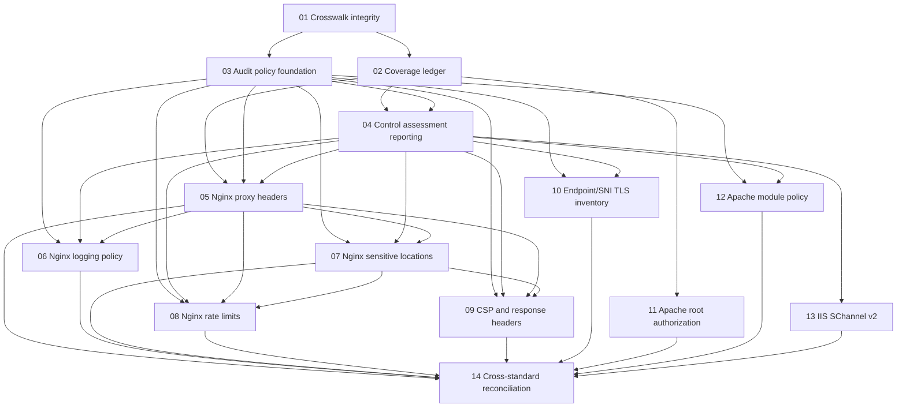

# Coverage Evidence Program Design

**Status:** Program specification for the follow-up PR series after PR #9
**Baseline commit:** `1e1cbbb` (`Add HTTP3 policy review and reconcile source coverage (#9)`)
**Program horizon:** follow-up PRs 01 through 14 defined in this document
**Primary objective:** improve the strength, traceability, and honesty of the
project's control-source coverage claims without turning context-dependent
configuration choices into noisy hard-coded findings.

---

## 1. Background

PR #8 introduced `docs/control-source-coverage-tracker.md` as the count ledger
behind the diploma-style coverage summary. PR #9 then:

- introduced the explicit `policy-review` evidence state;
- added opt-in Nginx HTTP/3 / `Alt-Svc` review;
- reclassified seven Nginx items and two Apache items as partial;
- kept IIS FTP uncovered and inside the denominator;
- preserved the conservative formula:

  `full coverage = full applicable items / all applicable items`;

- established that partial and policy-review evidence do not increase the
  numerator.

The post-PR #9 snapshot is:

| Source | Applicable | Full | Partial | Policy review | Uncovered |
| --- | ---: | ---: | ---: | ---: | ---: |
| CIS NGINX Benchmark v3.0.0 | 15 | 7 | 7 | 1 | 0 |
| CIS Apache HTTP Server 2.4 Benchmark v2.3.0 | 19 | 17 | 2 | 0 | 0 |
| CIS Microsoft IIS 10 Benchmark v1.2.1 | 10 | 8 | 1 | 0 | 1 |
| OWASP Top 10:2025 | 8 | 2 | 6 | 0 | 0 |
| OWASP ASVS v5.0.0 | 22 | 15 | 7 | 0 | 0 |
| NIST SP 800-52 Rev. 2 | 10 | 10 | 0 | 0 | 0 |
| PCI DSS v4.0.1 | 11 | 11 | 0 | 0 | 0 |
| ISO/IEC 27002:2022 | 10 | 8 | 2 | 0 | 0 |

The next stage is not a rule-count exercise. Most remaining gaps are caused by
one of four evidence limits:

1. the registry does not fully reproduce the mappings claimed in prose;
2. the correct answer depends on an operator-supplied policy;
3. the scanner does not know whether it observed the complete set of scopes,
   routes, listeners, SNI names, or host settings;
4. the source is broader than web-server configuration analysis and must remain
   partial or uncovered.

---

## 2. Program Decisions

### 2.1 Preserve the default low-noise behavior

No follow-up PR may turn an existing `policy-review` observation into a
default blocking finding merely to increase a coverage percentage.

Without an explicit policy or completeness declaration:

- current default rules continue to run;
- policy-dependent checks remain silent or informational;
- unknown values remain unknown;
- absence of optional evidence does not become a vulnerability;
- the conservative source snapshot does not receive automatic full credit.

### 2.2 Separate capability coverage from run assessment

The program introduces two related but different concepts.

**Source capability coverage** answers:

> Can the project, given the inputs that its documented interface accepts,
> verify all required subclaims of this counted source item?

This is the basis for the repository coverage ledger and percentages.

**Run assessment** answers:

> For this concrete target, policy, and declared scope, did the collected
> evidence pass, fail, remain indeterminate, or not apply?

A successful run assessment does not by itself change the project-wide
coverage percentage. A source item may move to `full` only when the
machine-readable ledger demonstrates that:

- every mandatory subclaim is implemented;
- the required inputs are documented;
- incomplete inputs yield `indeterminate`, not a false pass;
- the supported scope is explicit;
- tests cover positive, negative, inheritance/scope, and incomplete-evidence
  cases;
- registry metadata and documentation agree.

### 2.3 Treat policy as typed input, not free-form suppression

Suppressions explain why a finding is accepted. Baselines record previously
known findings. Neither defines the desired security posture.

The new policy mechanism must therefore be separate from:

- suppression YAML;
- baseline JSON;
- severity calibration;
- `policy-review` opt-in selection.

The policy supplies expected values, approved exceptions, scope declarations,
and completeness assertions. It must not silently hide default findings.

### 2.4 Keep IIS FTP uncovered

The previous product decision remains binding for this program:

- IIS FTP §6.1 / §6.2 stays `uncovered`;
- it stays in the applicable denominator;
- it is not relabeled `excluded`;
- no FTP parser or FTP active-probe PR is included in this program;
- the final reconciliation must continue to display the limitation.

Adding IIS FTP support requires a separate future product-scope decision.

### 2.5 Defer Caddy

Caddy support is not part of this coverage-evidence program. The current work
is tied to the server families and control sources already used in the
pre-diploma report. A future Caddy decision must be based on absolute adoption,
distinct configuration semantics, expected rule reuse, maintenance cost, and
the value of adding a fifth local parser.

### 2.6 Do not claim standard compliance

Repository language must use formulations such as:

- "scanner-evidence coverage within the declared scope";
- "the tool covers this counted source item";
- "the current run passed the declared policy";
- "partial evidence";
- "bounded runtime evidence".

It must not say that the tool certifies:

- OWASP Top 10 compliance;
- ASVS compliance;
- PCI DSS compliance;
- ISO/IEC 27002 compliance;
- full organizational control implementation.

---

## 3. Follow-up PR Sequence

The program contains fourteen PRs. The sequence is intentional.

| Follow-up | Title | Main outcome | Depends on |
| --- | --- | --- | --- |
| 01 | Crosswalk integrity | Correct mapping drift and freeze unsupported percentage changes | PR #9 |
| 02 | Machine-readable coverage ledger | One validated source of truth for counts and subclaims | 01 |
| 03 | Audit policy foundation | Versioned, typed, optional policy input threaded through analyzers | 01 |
| 04 | Control assessment reporting | Pass/fail/indeterminate/not-applicable output separate from findings | 02, 03 |
| 05 | Nginx reverse-proxy header semantics | Effective request/response proxy-header evidence under explicit policy | 02, 03, 04 |
| 06 | Nginx logging policy | Policy-aware access/error-log assessment | 03, 04, 05 |
| 07 | Nginx sensitive-location policy | Operator catalog plus effective location/access evidence | 03, 04, 05 |
| 08 | Nginx rate-limit policy | Workload-aware rate/connection assessment | 03, 04, 05, 07 |
| 09 | CSP and response-header policy | Correct CSP model plus route/header inventory assessment | 03, 04, 05, 07 |
| 10 | Endpoint/SNI TLS inventory | Completeness-aware certificate, chain, cipher, and revocation evidence | 03, 04 |
| 11 | Apache root authorization baseline | Direct §4.1 evidence and explicit §4.2 limits | 02 |
| 12 | Apache module inventory policy | Snapshot-based module minimization against operator policy | 03, 04 |
| 13 | IIS SChannel evidence v2 | Enabled/disabled/default/unknown states and complete snapshot semantics | 04 |
| 14 | Final cross-standard reconciliation | Atomic recount and final documentation after all accepted evidence changes | 01-13 |

PR 11 can be implemented before the policy consumers because it adds direct
parser/effective-config evidence. PRs 05-10, 12, and 13 must not invent
one-off policy or assessment formats; they consume the shared contracts from
PRs 03 and 04. PR 05 also establishes the reusable Nginx effective-scope
graph consumed by PRs 06-09, while PR 07 establishes the bounded location and
sample-URI selection model consumed by PRs 08 and 09.

---

## 4. Dependency Graph



---

## 5. Shared Domain Model

The exact class locations are specified in the individual PR documents. The
program-level semantic contract is fixed here.

### 5.1 Coverage ledger concepts

Every counted item has:

- source family;
- exact version;
- item identifier;
- short project-authored summary;
- claim type;
- applicability statement;
- required subclaims;
- evidence bindings;
- current status;
- declared scope;
- limitations;
- review date;
- implementation PR reference.

Allowed claim types:

- `benchmark_item`;
- `requirement`;
- `category_alignment`;
- `organizational_control`.

Allowed source statuses:

- `full`;
- `partial`;
- `policy-review`;
- `uncovered`;
- `excluded`.

`category_alignment` and `organizational_control` entries require especially
careful wording because OWASP Top 10 and ISO/IEC 27002 are not equivalent to
narrow scanner requirements.

### 5.2 Policy concepts

The top-level policy is versioned. It can contain independent sections such as:

- logging requirements;
- sensitive route catalog;
- rate and connection limits;
- response-header expectations;
- Apache module expectations;
- endpoint/SNI inventory;
- trust-store selection.

An absent section means "no operator policy supplied for this topic". It does
not mean a permissive policy and does not disable default rules.

Policy values must carry enough identity to match a server scope:

- server family;
- host or server name;
- listener;
- path matcher;
- site/application identifier;
- environment or deployment label.

### 5.3 Assessment concepts

Every control assessment has:

- assessment ID;
- source item ID;
- status: `pass`, `fail`, `partial`, `review`, `indeterminate`,
  `not-assessed`, or `not-applicable`;
- evidence references;
- evaluated scope;
- policy source, when applicable;
- completeness state;
- reasons;
- related finding fingerprints;
- limitations.

`pass` is forbidden when a mandatory evidence source is incomplete or unknown.

### 5.4 Evidence references

Evidence may point to:

- a finding;
- an analysis issue;
- a parsed directive;
- an effective configuration value;
- a registry setting;
- an external HTTP/TLS observation;
- a policy declaration;
- an inventory completeness declaration.

Evidence must preserve source traceability:

- file and line for text configuration;
- file and XML path/scope for IIS;
- registry URI and host for SChannel;
- target URL, SNI, protocol, and observation for external mode;
- policy file path plus logical key for operator input.

---

## 6. Status Semantics

### 6.1 Source status

`full` means the tool implements every mandatory subclaim for the documented
scope and correctly reports incomplete evidence as indeterminate.

`partial` means at least one real subclaim is implemented, but the complete
source item cannot be proven.

`policy-review` means the tool surfaces relevant facts, but it does not compare
them with a declared expected state.

`uncovered` means the item remains applicable and no adequate evidence path is
implemented.

`excluded` means the item is outside the denominator for a documented reason.

### 6.2 Run status

`pass` means all mandatory subclaims passed for the declared and complete run
scope.

`fail` means direct evidence proves that at least one mandatory declared
condition is not met.

`partial` means useful evidence exists, but one or more material facets remain
unassessed or are supported only by partial mappings.

`review` means the evidence is available but requires operator judgment; this
includes `policy-review` controls without automated pass/fail semantics.

`indeterminate` means the item is relevant but required evidence, policy, or
scope completeness is missing.

`not-assessed` means no applicable evidence was selected or executed for the
item.

`not-applicable` means the policy or detected target characteristics establish
that the item does not apply.

### 6.3 Findings and assessments

Findings remain security observations with severity.

Assessments are not assigned vulnerability severity. They may reference
findings, but a failed assessment can also be caused by:

- a missing required policy declaration;
- incomplete inventory;
- conflicting evidence;
- an unsupported dynamic configuration construct.

Technical failures remain `AnalysisIssue` entries.

---

## 7. Compatibility Contract

Every follow-up PR must preserve these defaults unless its specification says
otherwise:

- existing CLI commands continue to work without new arguments;
- `--policy` is optional;
- existing JSON fields remain present and retain their meaning;
- new report fields are additive;
- current suppression and baseline formats remain readable;
- rule IDs are not renamed casually;
- source locations remain stable;
- `policy-review` remains excluded by default;
- optional policy assessment does not alter severity calibration;
- a malformed explicit policy produces exit code 1;
- an absent optional policy produces no error;
- old IIS SChannel export files remain readable during the v2 migration.

---

## 8. Testing Strategy

### 8.1 Required test layers

Every implementation PR must include, where relevant:

1. unit tests for schema parsing and semantic helpers;
2. a positive unsafe case;
3. a negative safe case;
4. an inherited or effective-scope case;
5. an incomplete/unknown evidence case;
6. a malformed explicit-input case;
7. a false-positive boundary;
8. CLI tests;
9. JSON contract tests;
10. documentation/registry/ledger drift tests.

### 8.2 Cross-mode tests

When local configuration intent is corroborated externally, tests must cover:

- local unsafe + runtime unsafe;
- local safe + runtime safe;
- local safe + runtime unsafe;
- local unsafe + runtime safe;
- missing runtime evidence;
- multiple hosts/SNI names/routes;
- evidence from a different target that must not be joined.

### 8.3 Full-suite gate

Before each PR is ready:

```powershell
uv run --locked pytest tests `
  --ignore=tests/integration_external `
  --ignore=tests/integration_local `
  --ignore=tests/integration_optional_external `
  --ignore=tests/integration_real_world_cross_mode `
  --ignore=tests/integration_rule_coverage `
  -q -rs
uv run --locked ruff check .
uv run --locked interrogate -c pyproject.toml src
git diff --check
```

Docker-backed integration tests must run when Docker Desktop is available. A
PR must state explicitly when they were not run.

---

## 9. Coverage Change Gate

A PR may update a percentage only when all of the following are included in the
same PR:

- implementation evidence;
- positive, negative, scoped, and incomplete-evidence tests;
- registry metadata;
- machine-readable ledger update;
- generated or synchronized Markdown summaries;
- exact numerator and denominator calculation;
- explanation of whether the denominator changed;
- limitation wording;
- review of cross-standard consequences.

The following never increase the numerator by themselves:

- documentation-only mappings;
- a new `policy-review` rule;
- a `related` standards reference;
- a single observed runtime response;
- a single TLS handshake;
- a policy schema without a consuming assessment;
- a passing synthetic fixture;
- a larger raw rule count.

---

## 10. Anticipated Coverage Effects

These are candidates, not pre-approved percentage changes.

| Follow-up | Candidate effect |
| --- | --- |
| 01 | May correct metadata or wording; percentages are frozen pending ledger validation |
| 02 | No behavioral increase; makes every count reproducible |
| 03 | No increase; establishes policy input |
| 04 | No automatic increase; establishes run-level assessment |
| 05 | CIS NGINX §2.5.4 may move partial → full for statically determinable proxy scopes |
| 06 | CIS NGINX §3.1 and §3.3 gain policy-relative assessments; unconditional snapshot likely remains partial |
| 07 | CIS NGINX §5.1.1 gains catalog-relative assessment; unconditional snapshot likely remains partial |
| 08 | CIS NGINX §5.2.4/§5.2.5 gain workload-relative assessment; unconditional snapshot likely remains partial |
| 09 | Strengthens CIS NGINX §5.3.2/§5.3.3, ASVS 3.4.x, OWASP A02/A08, ISO 8.26, PCI 6.4.3; final status deferred |
| 10 | CIS NGINX §4.1.2 and ASVS/NIST/PCI TLS evidence may become full for declared complete inventory |
| 11 | Apache §4.1 subclaim may become direct/full; grouped §4.1/§4.2 item remains partial unless all subclaims close |
| 12 | Apache module minimization becomes assessable only with complete snapshot and policy |
| 13 | IIS SChannel item may move partial → full when v2 completeness requirements are satisfied |
| 14 | Performs the only program-wide final recount |

---

## 11. Review Size And PR Discipline

Each PR must remain independently reviewable:

- one evidence domain per PR;
- parser refactors only when required by that domain;
- no unrelated rule cleanup;
- no simultaneous standards recount and major behavior change except PR 14;
- no generated mass reformatting;
- no hidden denominator change;
- no publication to PyPI;
- no Caddy or FTP expansion.

If a specification proves too large during implementation, it must be split at
a data-model boundary, not arbitrarily by file count. The split must preserve a
working and tested intermediate state.

---

## 12. Program Completion Criteria

The program is complete when:

1. all accepted follow-up PRs are merged;
2. the coverage ledger is the source of truth;
3. registry mappings and ledger bindings are machine-validated;
4. every percentage is reproducible;
5. policy-dependent checks use one typed format;
6. incomplete evidence produces `indeterminate`;
7. no source claims are stronger than the implemented evidence;
8. IIS FTP remains visibly uncovered unless a later separate scope decision
   changes that;
9. NIST/PCI 100% rows are explicitly described as scoped scanner-evidence
   coverage, not compliance;
10. the final documentation explains what improved, what remains partial, and
    why.

---

## 13. Specification Index

- `2026-06-12-followup-01-crosswalk-integrity-design.md`
- `2026-06-12-followup-02-machine-readable-coverage-ledger-design.md`
- `2026-06-12-followup-03-audit-policy-foundation-design.md`
- `2026-06-12-followup-04-control-assessment-reporting-design.md`
- `2026-06-12-followup-05-nginx-reverse-proxy-header-semantics-design.md`
- `2026-06-12-followup-06-nginx-logging-policy-design.md`
- `2026-06-12-followup-07-nginx-sensitive-location-policy-design.md`
- `2026-06-12-followup-08-nginx-rate-limit-policy-design.md`
- `2026-06-12-followup-09-csp-and-response-header-policy-design.md`
- `2026-06-12-followup-10-endpoint-sni-tls-inventory-design.md`
- `2026-06-12-followup-11-apache-root-authorization-baseline-design.md`
- `2026-06-12-followup-12-apache-module-inventory-policy-design.md`
- `2026-06-12-followup-13-iis-schannel-evidence-v2-design.md`
- `2026-06-12-followup-14-final-cross-standard-reconciliation-design.md`
